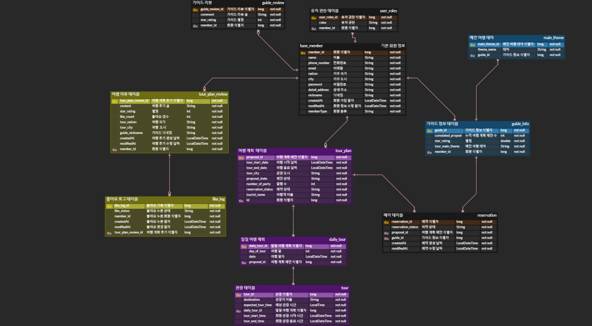

# ✈ 해외 배낭 여행 가이드 매칭 서비스

## 🎯 프로젝트 개요
- 스프링부트 기반의 웹 서비스
- 해외 배낭 여행 시 풍부한 관광 경험을 할 수 있도록 배낭 여행객과 현지 가이드를 연결해주는 서비스
- 여행자가 가이드를 선택하여 여행 계획을 전달 
- 가이드는 제안받은 여행 계획을 확인하여 수락 또는 거절
- 여행자는 여행 이후 후기 게시판에 여행 후기를 작성 가능
- 여행 후기 검색은 elastic search를 활용하여 검색어에 따른 검색 가능
- 가이드 예약은 redis를 활용하여 동시성 문제 해결

---
## 🛠 프로젝트 개발 환경
### 기술 스택

<div>


</div>


### 프로젝트 의존성
|이름| 버전      | 용도              |
|---|---------|-----------------|
|java| 11      |                 |
 |springboot| 2.7.14  | 웹 개발 프레임워크      |
|spring-data-jpa| 2.7.14  | ORM             |
|lombok: 1.18.28| 1.18.28 | 기계적인 코드 작성을 자동화 |
|spring-data-redis| 2.7.14  | redis 연결 및 사용   |
|spring-data-elasticsearch| 5.1.0   | 엘라스틱 서치 연결 및 사용 |
|spring-security|  2.7.14 | 보안 설정           |

### 프로젝트를 위한 사용 프로그램
|이름| 버전     | 용도               |
|---|--------|------------------|
|redis| latest | 동시성 문제 해결 및 캐시   |
|elastic search|  5.1.0 | 텍스트 데이터 검색 속도 향상 |

---
## ⚙ 커밋 메세지 규칙

- 기본 구조
```text
commit type: 주제

body
- 주제에 대한 설명

```

- commit type
  - 기능 구현: feat
  - 리팩터링: refactor
  - 테스트: test
  - 의존성 변경: dependency
  - 문서 수정, 추가, 삭제: docs
  - 프로젝트 구조 수정: project
  - 프로젝트 설정 파일 변경: settings

---

## 💾 ERD


## 🧿 구현 예정 기능

### 회원

#### 회원 가입
  - 이름, 이메일, 전화번호, 주소, 비밀번호를 입력받아 회원가입
  - 중복 이메일, 전화번호 체크
  - 회원 가입시 입력받은 이메일을 통해 이메일 검증
  - 비밀번호는 해시알고리즘(HSA-512)을 이용하여 저장


#### 로그인
  - 이메일과 비밀번호를 입력받아 로그인 수행
  - 이메일을 통해 회원 가입 여부 판단
  - 이메일로 회원 조회
  - 입력받은 비밀 번호를 복호화해 조회된 회원의 비밀번호와 같은지 검증
  - 비밀번호 검증 후, jwt 토큰을 발급


#### 로그아웃
  - 발급한 토큰을 유효하지 않게 처리


#### 회원 정보 수정
  - 패스워드, 이메일, 전화번호와 거주지 등을 변경 


#### 회원 정보 삭제
  - 회원 탈퇴 시, 데이터베이스에서 삭제

  
#### 여행 계획 작성
  - 여행일 수만큼 일일 계획을 작성
    - (ex. 3일 여행이라면 3개의 일일 계획을 작성)
  - 일일 계획은 관광할 목적지 목록과 예상 관광 시간 기재


#### 이전 여행 계획 조회
  - 가이드가 승인하고 여행 다녀온 모든 여행 계획 조회
  - 여행 계획 중 제안 상태가 승인 상태인 계획만 조회
  - 조회 시점보다 여행 계획 종료 일자가 빠른 계획만 조회


#### 여행 계획 수정
  - 가이드에게 제안한 여행 계획의 상태가 보류 상태인 경우에만 수정 가능


#### 여행 계획 제안 취소
  - 가이드에게 제안한 여행 계획의 상태가 보류 상태인 경우에만 제안 취소 가능


#### 여행 계획 제안 기록 조회
  - 여행 제안 중 승인된 제안만 조회

  
#### 여행 후기 조회
  - 작성한 여행 후기 조회

---
### 가이드

#### 회원 가입
  - 이름, 이메일, 전화번호, 주소, 비밀번호를 입력받아 회원가입
  - 중복 이메일, 전화번호 체크
  - 회원 가입시 입력받은 이메일을 통해 이메일 검증
  - 비밀번호는 해시알고리즘(HSA-512)을 이용하여 저장

  
#### 로그인
  - 이메일과 비밀번호를 입력받아 로그인 수행
  - 이메일로 데이터베이스 조회를 통해 회원 가입 여부 판단
  - 입력받은 비밀 번호를 복호화해 조회된 회원의 비밀번호 동일성 검증
  - 비밀번호 검증 후, jwt 토큰을 발급


#### 로그아웃
  - 발급한 토큰을 유효하지 않게 처리


#### 가이드 정보 수정
  - 가이드의 패스워드, 연락처, 이메일와 거주지 등을 변경


#### 가이드 정보 삭제
  - 가이드의 회원 탈퇴 시, 가이드 정보 삭제


#### 제안받은 투어 예약 목록 조회
  - 예약 상태가 보류 상태인 투어 예약만 조회 


#### 계약 승인/거절 기능
  - 승인 시, 투어 예약 상태를 예약 확정으로 변경
    - 투어 예약을 제안한 여행자에게 승인 알림 전송
  - 거절 시, 투어 예약을 삭제
    - 투어 예약을 제안한 여행자에게 거절 알림 전송


#### 투어 일정 조회
  - 조회 시점 이후의 예약된 투어 일정만 조회

---
### 투어 예약

#### 가이드 별 예약 일정 조회
  - 예약 가능 여부 판단을 위해 가이드별 예약 일정 조회


#### 현재 예약 가능한 가이드 목록 조회
  - 여행 계획에 기재된 여행 날짜에 가용할 수 있는 가이드만 조회


#### 투어 예약
  - 투어가 예약되면 가이드에게 알림 전송
  - 예약은 가이드가 승인하기 전까지 보류 상태로 설정

---

### 여행 후기

- 승인된 여행 계획에 대해서 작성
- 여행 계획 종료 일자 이후부터 작성 가능

#### 여행 후기 글 작성
  - 회고 글 양식으로 자유로운 형태로 작성 


#### 여행 후기 좋아요
  - 여행 후기의 좋아요 버튼 클릭 시 좋아요 갯수 추가
  - 클릭한 적이 한번도 없는 사람인 경우에만 갯수 추가
  - 클릭한 적이 있다면 

  
#### 여행 후기 수정
  - 여행 후기 글 수정
  - 여행 후기 별점 수정


#### 여행 후기 삭제
  - 여행 후기 삭제 요청 시 삭제


#### 여행 후기 별점 작성
  - 후기에 작성된 별점으로 해당 여행 계획을 가이드한 가이드의 별점 업데이트


#### 여행 후기 조회
  - 여행 후기 별점 순 조회
  - 여행 후기 검색어에 따라 조회
  - 여행 후기 여행지에 따라 조회
  - 여행 후기 좋아요 개수에 따라 조회
